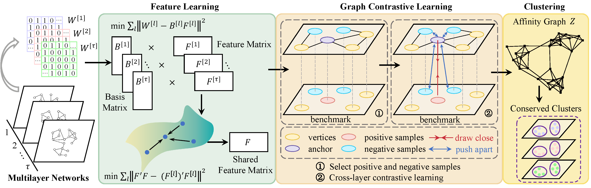

# GM-FGCL v1.0

## Clustering of Multi-layer Networks with Structure-guided Graph Contrastive Learning

Yifei Yang, Xiaoke Ma.

GM-FGCL is an algorithm for conserved module detection in multi-layer networks. The algorithm flow chart is as follows:

